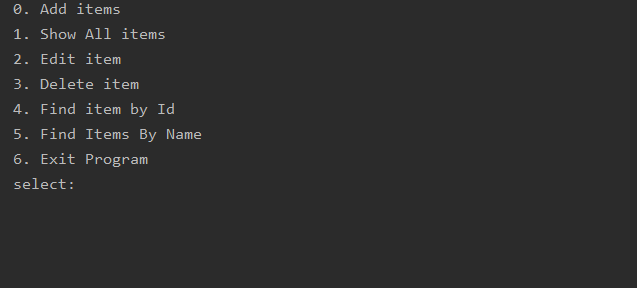

Application system - Tracker.
The project is a console application. The user is shown a menu with program capabilities.

#### Functionality:
- CRUD operations for items
- Console UI 

#### Technologies:
- PostgreSQL, JDBC or Hibernate (Optionally), Liquibase
- Maven, Travic CI

